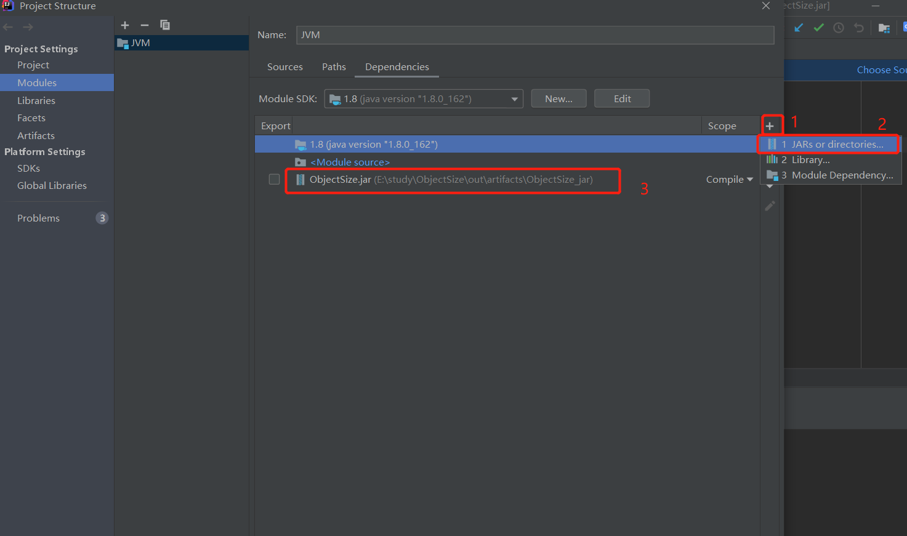

# ObjectSize
Agent 代理读取整个 Object 大小
## 导入 JAR 包


## 主函数代码

```java
import com.vnjohn.jvm.agent.ObjectSizeAgent;

public class SizeOfAnObject {
    public static void main(String[] args) {
        System.out.println(ObjectSizeAgent.sizeOf(new Object()));
        System.out.println(ObjectSizeAgent.sizeOf(new int[]{}));
        System.out.println(ObjectSizeAgent.sizeOf(new P()));
    }

    // 一个Object占多少个字节
    // -XX:+UseCompressedClassPointers -XX:+UseCompressedOops
    // Oops = ordinary object pointers  普通对象指针 
    private static class P {
                        //8 _markword
                        //4 _class pointer
        int id;         //4
        String name;    //4
        int age;        //4

        byte b1;        //1
        byte b2;        //1

        Object o;       //4
        byte b3;        //1

    }
}
```
## 修改启动参数
可选参数👇👇
+ 代表压缩普通对象,- 代表不进行压缩,按道理来说引用类型都是占用 8 字节的
  -XX:-UseCompressedOops
+ 代表 classPointer 只占用 4 字节进行压缩,- 代表不进行压缩仍为 8 字节
  -XX:+UseCompressedClassPointers

引入指定目录jar包文件
```java
-javaagent:E:\study\ObjectSize\out\artifacts\ObjectSize_jar\ObjectSize.jar
```
